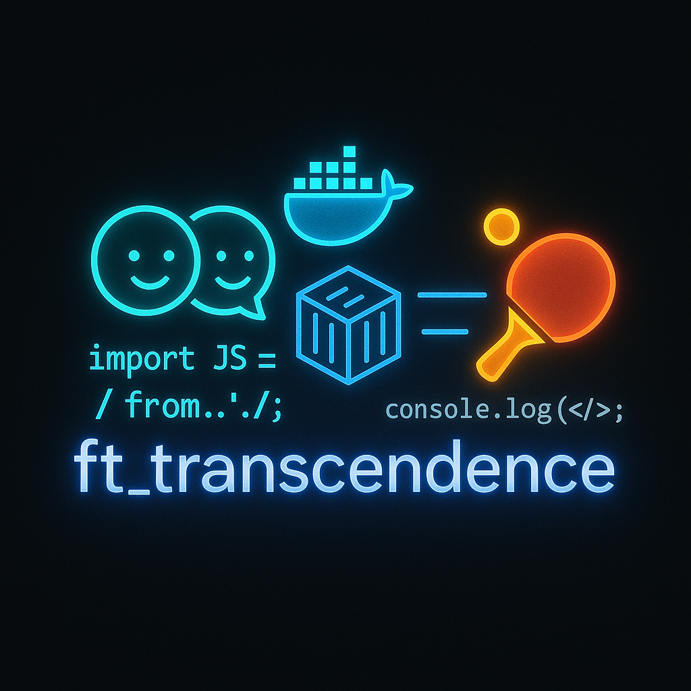
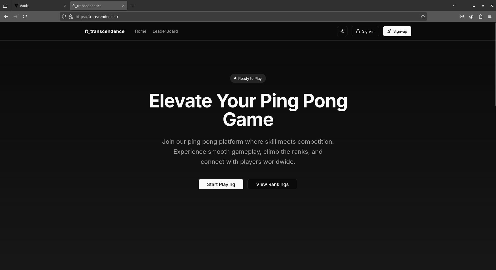
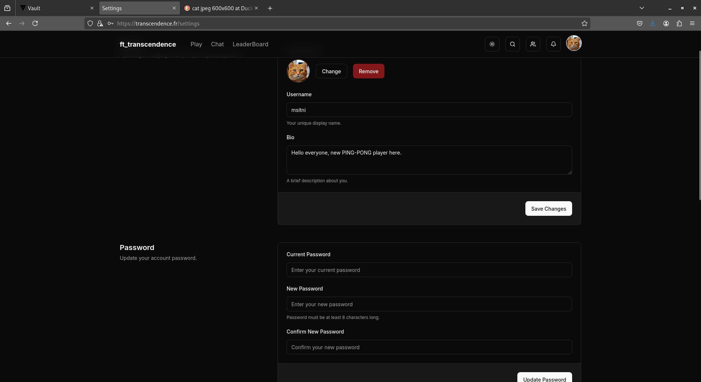
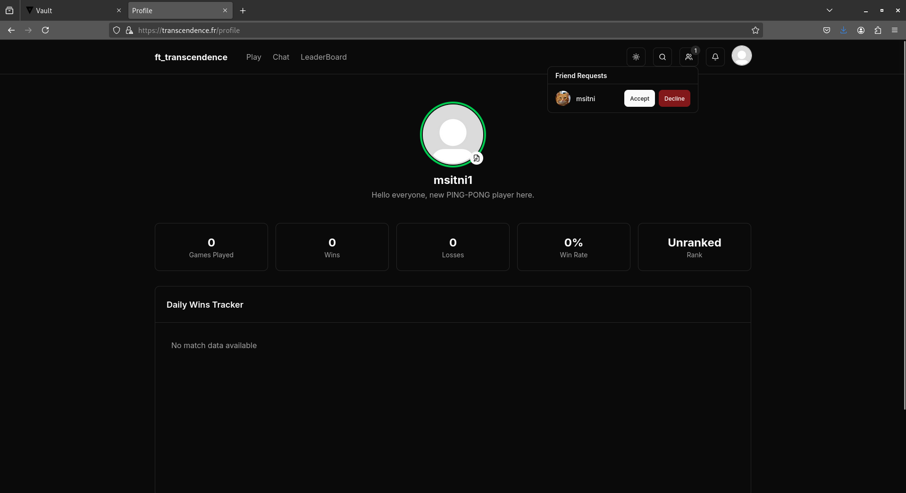
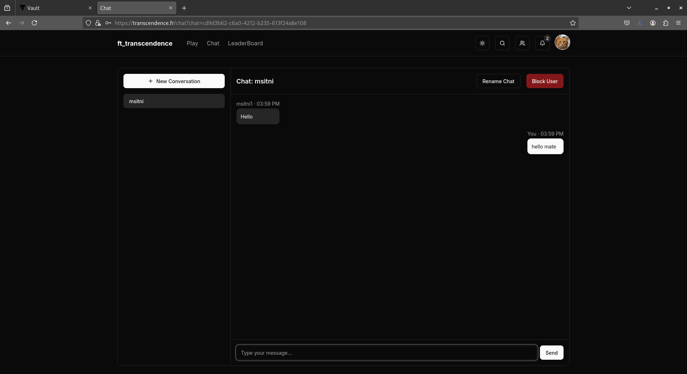

<!-- Improved compatibility of back to top link: See: https://github.com/othneildrew/Best-README-Template/pull/73 -->
<a id="readme-top"></a>
<!--
*** Thanks for checking out the Best-README-Template. If you have a suggestion
*** that would make this better, please fork the repo and create a pull request
*** or simply open an issue with the tag "enhancement".
*** Don't forget to give the project a star!
*** Thanks again! Now go create something AMAZING! :D
-->


<!-- PROJECT SHIELDS -->
<!--
*** I'm using markdown "reference style" links for readability.
*** Reference links are enclosed in brackets [ ] instead of parentheses ( ).
*** See the bottom of this document for the declaration of the reference variables
*** for contributors-url, forks-url, etc. This is an optional, concise syntax you may use.
*** https://www.markdownguide.org/basic-syntax/#reference-style-links
-->
[![Contributors][contributors-shield]][contributors-url]
[![Forks][forks-shield]][forks-url]
[![Stargazers][stars-shield]][stars-url]
[![Issues][issues-shield]][issues-url]
[![project_license][license-shield]][license-url]
[![LinkedIn][linkedin-shield]][linkedin-url]


<!-- PROJECT LOGO -->
<br />
<div align="center">
  <a href="https://github.com/msitni1337/ft_transcendence">
    
  </a>

<h3 align="center">ft_transcendence</h3>

  <p align="center">
    ft_transcendence the final 42’s Common Core Project.
    <br />
    &middot;
    <a href="https://github.com/msitni1337/ft_transcendence/issues/new?labels=bug&template=bug-report---.md">Report Bug</a>
    &middot;
    <a href="https://github.com/msitni1337/ft_transcendence/issues/new?labels=enhancement&template=feature-request---.md">Request Feature</a>
  </p>
</div>


<!-- TABLE OF CONTENTS -->
<details>
  <summary>Table of Contents</summary>
  <ol>
    <li>
      <a href="#about-the-project">About The Project</a>
    </li>
    <li>
      <a href="#getting-started">Getting Started</a>
      <ul>
        <li><a href="#prerequisites">Prerequisites</a></li>
        <li><a href="#installation">Installation</a></li>
      </ul>
    <li><a href="#contributing">Contributing</a></li>
    <li><a href="#license">License</a></li>
    <li><a href="#contact">Contact</a></li>
    <li><a href="#acknowledgments">Acknowledgments</a></li>
  </ol>
</details>


<!-- ABOUT THE PROJECT -->
## About The Project
<div align="center">






</div>

ft_transcendence is a full-stack web application that reimagines the classic Pong arcade game with modern functionalities, social features and robust security measures and best practices. Developed as part of my curriculum, this project challenged me to work with various technologies while adhering to strict requirements in performance, security, and scalability.


<!-- GETTING STARTED -->
## Getting Started

This is how you can build & setup `ft_transcendence` on your machine to enjoy playing Ping-Pong.

### Prerequisites

* Install required build tools: `make and docker`
  Get docker from: https://docs.docker.com/compose/install/
  ```sh
  sudo apt install make
  ```

### Installation

1. Through the power of docker compose and make you just need to type the following command to build and launch the application:
   ```sh
   make build
   ```
<p align="right">(<a href="#readme-top">back to top</a>)</p>

<!-- CONTRIBUTING -->
## Contributing

Contributions are what make the open source community such an amazing place to learn, inspire, and create. Any contributions you make are **greatly appreciated**.

If you have a suggestion that would make this better, please fork the repo and create a pull request. You can also simply open an issue with the tag "enhancement".
Don't forget to give the project a star! Thanks again!

1. Fork the Project
2. Create your Feature Branch (`git checkout -b feature/AmazingFeature`)
3. Commit your Changes (`git commit -m 'Add some AmazingFeature'`)
4. Push to the Branch (`git push origin feature/AmazingFeature`)
5. Open a Pull Request

<p align="right">(<a href="#readme-top">back to top</a>)</p>

### Top contributors:

<a href="https://github.com/msitni1337/ft_transcendence/graphs/contributors">
  
</a>


<!-- LICENSE -->
## License

Distributed under the MIT License. See `LICENSE.txt` for more information.

<p align="right">(<a href="#readme-top">back to top</a>)</p>


<!-- CONTACT -->
## Contact

Mohammed Sitni - msitni1337@gmail.com

Project Link: [https://github.com/msitni1337/ft_transcendence](https://github.com/msitni1337/ft_transcendence)

<p align="right">(<a href="#readme-top">back to top</a>)</p>


<!-- ACKNOWLEDGMENTS -->
## Acknowledgments

* [Oussama benchekroun](https://github.com/obenchkroune) Team mate with whome I worked in the project.

<p align="right">(<a href="#readme-top">back to top</a>)</p>


<!-- MARKDOWN LINKS & IMAGES -->
<!-- https://www.markdownguide.org/basic-syntax/#reference-style-links -->
[contributors-shield]: https://img.shields.io/github/contributors/msitni1337/ft_transcendence.svg?style=for-the-badge
[contributors-url]: https://github.com/msitni1337/ft_transcendence/graphs/contributors
[forks-shield]: https://img.shields.io/github/forks/msitni1337/ft_transcendence.svg?style=for-the-badge
[forks-url]: https://github.com/msitni1337/ft_transcendence/network/members
[stars-shield]: https://img.shields.io/github/stars/msitni1337/ft_transcendence.svg?style=for-the-badge
[stars-url]: https://github.com/msitni1337/ft_transcendence/stargazers
[issues-shield]: https://img.shields.io/github/issues/msitni1337/ft_transcendence.svg?style=for-the-badge
[issues-url]: https://github.com/msitni1337/ft_transcendence/issues
[license-shield]: https://img.shields.io/github/license/msitni1337/ft_transcendence.svg?style=for-the-badge
[license-url]: https://github.com/msitni1337/ft_transcendence/blob/master/LICENSE.txt
[linkedin-shield]: https://img.shields.io/badge/-LinkedIn-black.svg?style=for-the-badge&logo=linkedin&colorB=555
[linkedin-url]: https://linkedin.com/in/msitni